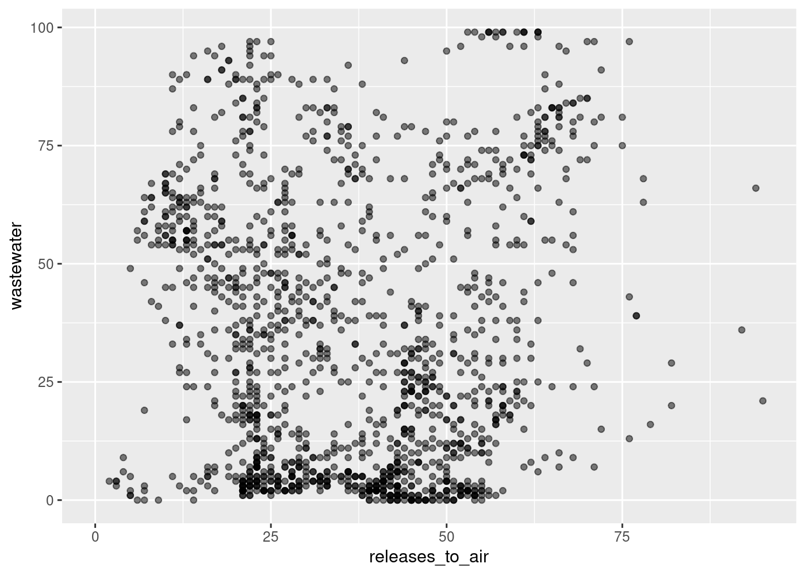
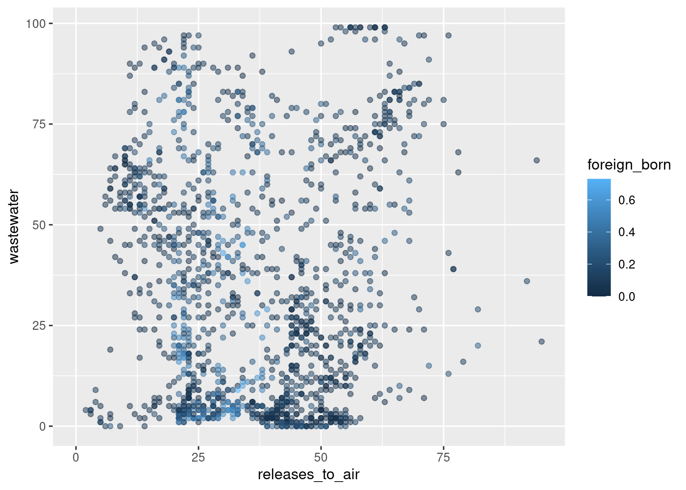
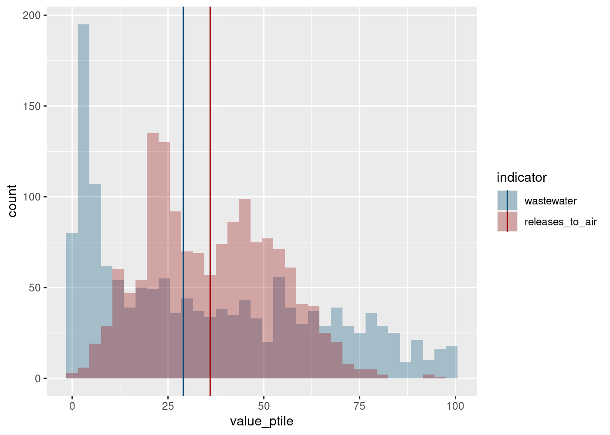

These look good, and I’m glad you are highlighting the distributions of
the two indices. The main thing is your charts are different ways to
show the same two variables, so they become redundant. The histogram and
the density plot are different ways of showing essentially the same
thing—they’re both good, but you should pick one, and then do something
different for another chart. You had talked earlier about joining the EJ
data with the ACS data, and I think that’s still a great idea. There are
some examples of that in the troubleshooting notes, but I can also help
you with specific steps if that’s something you want to do. Some more
specific suggestions:

## Debugging

In your final draft notebook, when you draw the histogram you get a
warning about a bunch of values being removed. You might expect a
handful of missing values (in your EDA you checked the number of NAs,
excellent call!), but this says there are 1,462. That’s a red flag, so
you want to go back and look at the structure of the data you’re
plotting (ej_spread). In lines 33 and 34 where you call `pivot_wider`,
you’re getting a bunch of NAs:

``` r
library(justviz)
library(dplyr)
library(ggplot2)

ej_subset <- ej_natl |>
  filter(indicator %in% c("releases_to_air", "wastewater"))

head(ej_subset)
```

    # A tibble: 6 × 5
      tract       indicator       value_ptile d2_ptile d5_ptile
      <chr>       <fct>                 <int>    <int>    <int>
    1 24001000100 releases_to_air          44       34       50
    2 24001000100 wastewater               53       40       58
    3 24001000200 releases_to_air          94       77       83
    4 24001000200 wastewater               66       65       69
    5 24001000500 releases_to_air          71       80       87
    6 24001000500 wastewater                7       14       13

``` r
ej_spread1 <- ej_subset |>
  tidyr::pivot_wider(names_from = indicator, values_from = value_ptile)

head(ej_spread1)
```

    # A tibble: 6 × 5
      tract       d2_ptile d5_ptile releases_to_air wastewater
      <chr>          <int>    <int>           <int>      <int>
    1 24001000100       34       50              44         NA
    2 24001000100       40       58              NA         53
    3 24001000200       77       83              94         NA
    4 24001000200       65       69              NA         66
    5 24001000500       80       87              71         NA
    6 24001000500       14       13              NA          7

``` r
sum(is.na(ej_spread1))
```

    [1] 2960

In ej_spread, your tracts are duplicated (2 rows each when you would
expect 1 row each) and your two indicator columns alternate between NAs.
The reason for that is `pivot_wider` doesn’t know to drop the d2 and d5
columns. It expects there to be one or more identifier columns (the
`id_cols` argument), and in order to avoid dropping data when you don’t
expect it, that defaults to all the columns in the data frame that you
haven’t otherwise specified. In this case, since you’re only concerned
with the value_ptile values, you want to specify an ID, which is tract:

``` r
ej_spread2 <- ej_subset |>
  tidyr::pivot_wider(id_cols = tract, names_from = indicator, values_from = value_ptile)

head(ej_spread2)
```

    # A tibble: 6 × 3
      tract       releases_to_air wastewater
      <chr>                 <int>      <int>
    1 24001000100              44         53
    2 24001000200              94         66
    3 24001000500              71          7
    4 24001000600              78         63
    5 24001000700              78         68
    6 24001000800              75         75

``` r
sum(is.na(ej_spread2))
```

    [1] 28

There are still a few NAs, but more in the range you’d expect.

The other red flag is that your scatterplot has so few points, and it’s
for the same reason, that most of your pairs of values per tract got
lost. You should expect it to look more like this, with a warning about
a few NAs being removed:

``` r
ggplot(ej_spread2, aes(x = releases_to_air, y = wastewater)) +
  geom_point(alpha = 0.5)
```

    Warning: Removed 16 rows containing missing values or values outside the scale range
    (`geom_point()`).



However, I see you also want to color by d2 percentile. Since each tract
actually has 2 d2 values (one for releases, one for wastewater) you have
to make a decision here. Think about what the d2 values bring into the
mix that’s not already in the scatterplot: they scale by low-income rate
and percent people of color, and that scaling is the same for the two
risk factors. Both low-income rate and percent POC are available in the
ACS data (since the race/ethnicity groups are percentages, you can just
do 1 - white to get percent non-white), so if you join the EJ data with
ACS, you could color by one (or both, and then you’ve knocked out 2 of
your 3 charts). Here’s an example that is *extremely similar* but a
different ACS variable so you can still figure out how you want to
approach yours:

``` r
ej_x_acs <- ej_spread2 |>
  inner_join(acs, by = c("tract" = "name"))

ggplot(ej_x_acs, aes(x = releases_to_air, y = wastewater, color = foreign_born)) +
  geom_point(alpha = 0.5)
```

    Warning: Removed 2 rows containing missing values or values outside the scale range
    (`geom_point()`).



## Scatterplot

Aside from the debugging, give some information on what these values
mean (esp since your goal was to have titles and labels match the data
well). Specify the year (2022), unit (Maryland tract), and source (EPA
EJSCREEN). Give information on how these values were calculated: you can
fit some of that in the subtitle
(`labs(subtitle = "Nationally ranked percentiles of blah blah blah")`),
or fit more detail into a caption with the source
(`labs(caption = "blah blah")`). You also don’t need to say that it’s a
scatterplot in the title; since your charts are a bit more technical,
you can expect that your audience will understand that. You could just
say something like “Risk of toxins released to air versus proximity to
wastewater treatment”.

## Histogram and density

Like I said, you should pick one of the two of these. On the histogram,
notice that you didn’t get a legend—the reason for that is you don’t
have anything fill-related in your `aes`. You kinda hacked it into your
density chart. For either of these, what you want to do is use the
long-shaped data instead (`ej_subset`), and assign the indicator to fill
(for the histogram) or color and/or fill (for the density).

I like the idea of annotating with a dashed line like on the density
plot, although that information is already on the axis. Drawing a line
for the mean and/or median value is often helpful for these types of
distribution plots though. You could do something like this (technically
you’d want to calculate weighted means or medians, weighted by
population, but this simplified version is fine for this project):

``` r
# save the colors you made into a vector to reuse
ej_pal <- c(releases_to_air = "#990000", wastewater = "#034e7b")
ej_avgs <- ej_subset |>
  group_by(indicator) |>
  summarise(med_value_ptile = median(value_ptile, na.rm = TRUE))

ej_avgs
```

    # A tibble: 2 × 2
      indicator       med_value_ptile
      <fct>                     <int>
    1 wastewater                   29
    2 releases_to_air              36

``` r
ggplot(ej_subset, aes(x = value_ptile, fill = indicator)) +
  geom_histogram(alpha = 0.3, 
                 position = position_identity(), # use identity so they don't get stacked
                 binwidth = 3) + # make sure to adjust the binwidth or number of bins!
  geom_vline(aes(xintercept = med_value_ptile, color = indicator), data = ej_avgs) +
  scale_fill_manual(values = ej_pal) +
  scale_color_manual(values = ej_pal)
```

    Warning: Removed 28 rows containing non-finite outside the scale range
    (`stat_bin()`).



And then make a note in the subtitle stating that the lines are medians.
That’s just one idea though.
